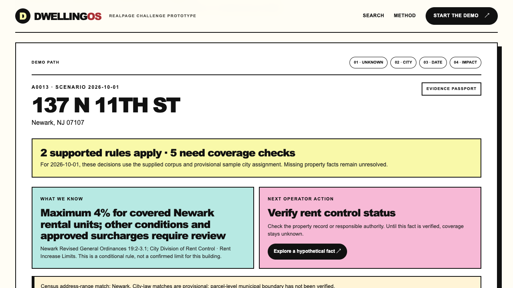

# DwellingOS

**A source-backed Property Law Passport for RealPage's Rental Housing Law Navigator challenge.** Enter one of the supplied 500 addresses to see the rules that may apply on a given date, the exact source behind each result, and the property fact an operator must verify before treating a conditional rule as settled.

**[Open the live judge demo](https://dwelling.hovhannes.dev/)** · [One-minute demo plan](docs/demo-video-script.md) · [Technical architecture](docs/architecture.md) · [Measured scale path](docs/scale-architecture.md)



*Live product capture, not a mockup. The 4% figure is conditional on legal coverage; the sample property has not been certified as covered.*

## Try the judge path in one minute

1. In the [live demo](https://dwelling.hovhannes.dev/), choose **01 · Unknown**. See the possible Newark rent ceiling, its source, and the explicit `rent_control_status` evidence gap. The hypothetical fact control shows how the decision would change; it does not save or verify a fact.
2. Choose **03 · Date**. Compare a California rule before and after its effective date.
3. Choose **04 · Impact**. Inspect the five supplied law-change scenarios, candidate addresses, and possible state/local conflicts. Candidate counts are not confirmed building-level coverage.

The interface is a static, precomputed judge demo. The local server adds a separate operator workbench for importing a new property and previewing a newly supplied law; that workflow is **not** available on static hosting.

## Reproduce the build

Requires Python 3 and Node.js/npm. The challenge starter pack is bundled, so no API key or machine-specific path is required for the core pipeline.

```bash
git clone https://github.com/hhovhan/dwellingos.git
cd dwellingos
npm run pipeline       # audit, extract, evaluate, test, validate outputs
npm run build:static   # create the deployable dist/ snapshot
npm start              # local product + operator workbench at http://127.0.0.1:4173
```

The GitHub clone command works for reviewers **only after this repository is public**; until then, access requires the owner's authorization. The competition JSON files are in `output/rules.json`, `output/lookups.json`, and `output/changes.json`.

| Stage | Implementation | Checkable artifact |
| --- | --- | --- |
| Source audit and extraction | `scripts/audit_corpus.py`, `scripts/extract_rules.py`, `engine/law_intake.py` | `output/corpus_audit.json`, `output/rules.json`, candidate/rejection queues |
| Address and date decisions | `engine/portfolio.py`, `engine/evaluator.py`, `scripts/build_outputs.py` | 500 passports and `output/lookups.json` |
| Law-change impact | `engine/change_tracker.py` | `output/changes.json`, five supplied scenarios |
| New-source review and larger portfolios | `engine/source_monitor.py`, `scripts/intake_law.py`, `scripts/approve_candidate.py`, `scripts/portfolio_cli.py` | Reviewed intake path and indexed SQLite assessment |
| Regression and release gates | `tests/`, `quality/`, `scripts/release_check.py` | Unit, holdout, reference, and output-contract results |

The decision path is **source text → evidence-linked rule candidate → review gate → deterministic jurisdiction/date/coverage evaluator → cited passport**. A text candidate cannot silently become an operative law; unfamiliar sources require a reviewer to supply legal force, dates, coverage and citation. The rule engine does not use an LLM to make the final applicability decision. [Architecture diagram and failure policy](docs/architecture.md).

## What is verified—and what is not

On the current build, the pipeline processes **500/500** sample properties into **5,419** rule evaluations, emits **57** evidence-linked candidate rules, and passes **47** automated tests, **9/9** targeted extraction checks, **11/11** targeted address checks, and **20/20** non-attorney reference decisions. All *emitted* rules have a source URL, citation and verbatim quotation. These checks do **not** measure full-corpus extraction recall or predict the organizer's private score. [Holdout method](docs/holdout-evaluation.md) · [One-page method and evidence backlog](docs/method-note.md).

The 87-entry starter manifest contains 54 captured texts and 33 link-only records. Of the 57 emitted rules, 53 are from supplied captured texts and four are from independently checked supplements; supplemental rules are **not** claimed as supplied-corpus citation credit. Much of the baseline extraction uses explicit, document-specific review profiles. A separate generic intake proposes candidates from unfamiliar text, but it does not auto-publish them. No attorney has certified the rules.

The sample also has unresolved address and building facts: 383 single Census address-range matches, 117 unresolved or ambiguous matches, 27 ZIP/state-prefix conflicts, and 462 provisional postal-city assignments. A Census address-range match is **not** parcel-level municipal-boundary proof. Missing units, construction years, owner type, and occupancy evidence remain visible; the evaluator returns `unknown` instead of inventing them.

The indexed portfolio path imported **20 million synthetic rows** in 133.488 seconds and assessed 2 million city candidates against one rule in 25.927 seconds on this machine. This demonstrates bounded-memory import and indexed evaluation at that row count—not verified law coverage, fresh facts for 20 million real homes, concurrent production reliability, or a deployable RealPage integration. [Benchmark details and commands](docs/scale-architecture.md).

This is an independent hackathon research prototype, not legal advice, a compliance certification, or a product endorsed by RealPage.
