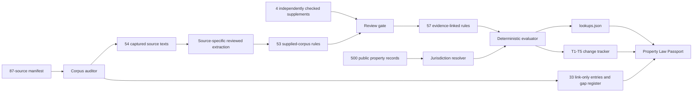

# DwellingOS architecture

The competition baseline uses document-specific review profiles; it does not claim general-purpose legal extraction. A separate source-independent intake can propose verbatim candidates from unfamiliar text, but a reviewer must provide legal force, dates, coverage and citation before publication. The deterministic evaluator—not an LLM—controls jurisdiction, time status and allowed output vocabulary. Every result retains its rule ID and source URL.

The public website reads precomputed output for the 500 supplied properties. The local server additionally exposes an operator workbench for new-property import and law-source preview; that API is not deployed with the static website. The indexed SQLite portfolio path reuses the evaluator without loading 20 million properties into a browser. This is a measured scaling path, not a production RealPage integration.

## Failure policy

- Missing property fact: return `unknown` and name the missing fact.
- Future effective date: return `not_yet_effective`.
- Pending bill: return `pending`.
- Failed measure: exclude from live lookups.
- State/local interaction: preserve both rules and set `conflict_flag` for review.
- Missing source: register the gap; never fabricate a replacement citation.
