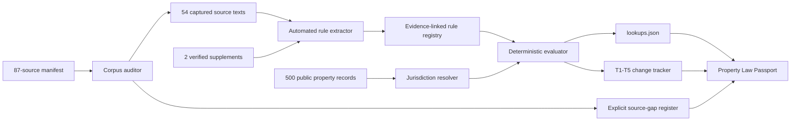

# DwellingOS architecture

The model-assisted portion may identify candidate text, but it never owns the final result. The deterministic evaluator controls jurisdiction, time status and allowed output vocabulary. Every result retains its rule ID and source URL.

## Failure policy

- Missing property fact: return `unknown` and name the missing fact.
- Future effective date: return `not_yet_effective`.
- Pending bill: return `pending`.
- Failed measure: exclude from live lookups.
- State/local interaction: preserve both rules and set `conflict_flag` for review.
- Missing source: register the gap; never fabricate a replacement citation.
